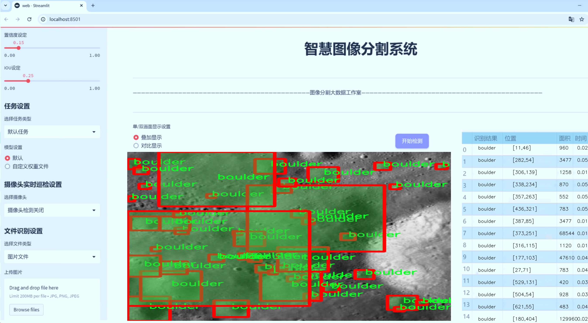
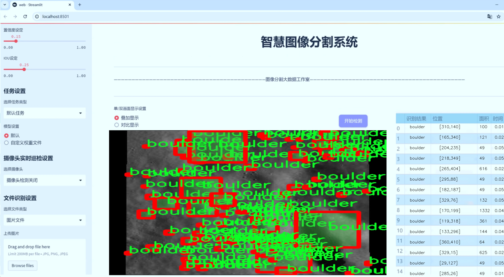
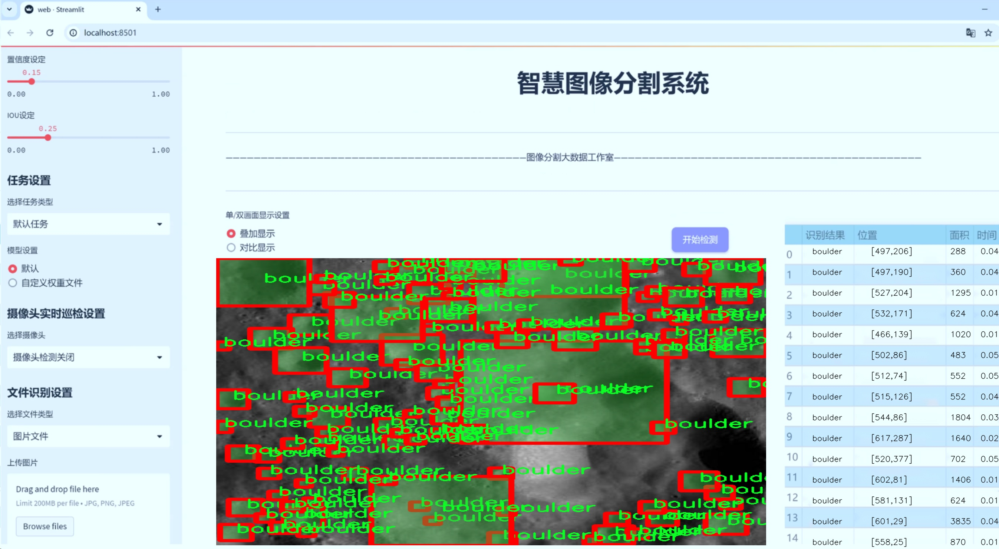
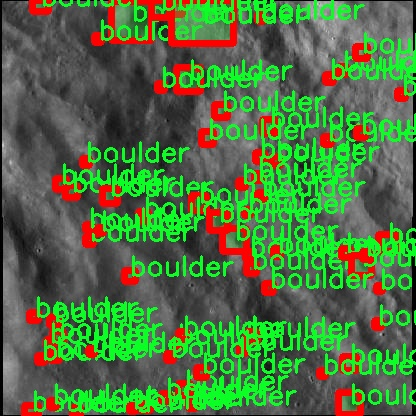
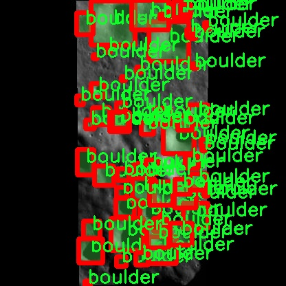
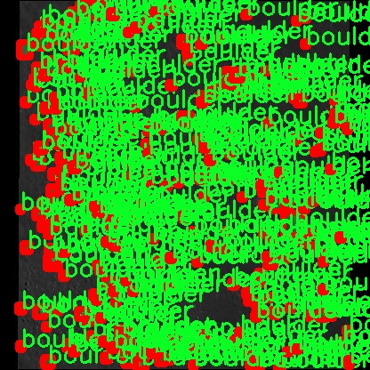
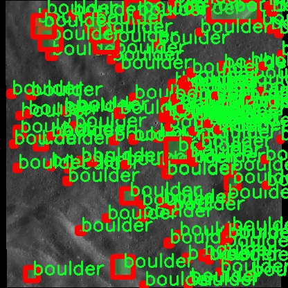

# 陨石坑与巨石分割系统： yolov8-seg-AFPN-P345

### 1.研究背景与意义

[参考博客](https://gitee.com/YOLOv8_YOLOv11_Segmentation_Studio/projects)

[博客来源](https://kdocs.cn/l/cszuIiCKVNis)

研究背景与意义

随着遥感技术和计算机视觉的快速发展，陨石坑与巨石的检测与分割在行星科学、地质勘探以及天体物理学等领域的重要性日益凸显。陨石坑作为天体表面撞击事件的直接证据，能够为我们提供关于天体历史、演化过程及其表面特征的重要信息。而巨石的分布和形态则反映了行星表面的地质活动及其环境条件。因此，准确、高效地检测和分割陨石坑与巨石，不仅能够促进对行星表面特征的深入理解，还能为未来的行星探测任务提供重要的科学依据。

近年来，深度学习技术在图像处理领域取得了显著进展，尤其是目标检测和实例分割任务中，基于卷积神经网络（CNN）的模型表现出色。YOLO（You Only Look Once）系列模型因其高效性和实时性而广泛应用于各种目标检测任务。YOLOv8作为该系列的最新版本，结合了多种先进的技术，具备了更强的特征提取能力和更高的检测精度。然而，针对特定领域的应用，尤其是陨石坑与巨石的检测，仍然存在一定的挑战。这些挑战主要体现在复杂的背景、不同的尺度以及形状多样性等方面。因此，基于改进YOLOv8的陨石坑与巨石分割系统的研究具有重要的理论和实践意义。

本研究基于一个包含1600幅图像的数据集，专注于陨石坑和巨石的实例分割任务。该数据集的类别包括“陨石坑”和“巨石”，为模型的训练和评估提供了良好的基础。通过对数据集的深入分析，我们可以识别出陨石坑与巨石在图像中的特征和规律，从而为模型的改进提供数据支持。此外，实例分割不仅要求模型能够识别目标的类别，还需要精确地分割出目标的轮廓，这对于后续的科学分析和数据处理至关重要。

本研究的意义在于，通过改进YOLOv8模型，提升陨石坑与巨石的检测与分割精度，进而推动行星科学研究的进展。高效的检测与分割系统将为科学家提供更为可靠的数据支持，帮助他们在分析行星表面特征、研究天体撞击历史以及评估地质活动等方面取得更深入的成果。此外，改进后的模型不仅适用于行星科学领域，还可以推广到其他相关领域，如地质勘探、环境监测等，具有广泛的应用前景。

综上所述，基于改进YOLOv8的陨石坑与巨石分割系统的研究，不仅填补了现有技术在特定领域应用中的空白，也为未来的行星探测任务提供了强有力的技术支持。通过不断优化模型性能和提升数据处理能力，我们有望在行星科学研究中取得更为显著的进展，为人类对宇宙的探索和理解贡献新的力量。

### 2.图片演示







注意：本项目提供完整的训练源码数据集和训练教程,由于此博客编辑较早,暂不提供权重文件（best.pt）,需要按照6.训练教程进行训练后实现上图效果。

### 3.视频演示

[3.1 视频演示](https://www.bilibili.com/video/BV1syBWYyEyX/)

### 4.数据集信息

##### 4.1 数据集类别数＆类别名

nc: 2
names: ['boulder', 'crater']


##### 4.2 数据集信息简介

数据集信息展示

在当今的计算机视觉领域，尤其是在地质探测和天体物理研究中，陨石坑与巨石的检测与分割扮演着至关重要的角色。为此，我们构建了一个专门的数据集——“CRATERS AND BOULDERS DETECTION”，旨在为改进YOLOv8-seg模型提供高质量的训练数据。该数据集专注于两个主要类别：陨石坑（crater）和巨石（boulder），共计两个类别（nc: 2），这些类别的选择是基于它们在地表特征分析中的重要性以及在遥感图像中的普遍存在。

“CRATERS AND BOULDERS DETECTION”数据集的构建过程涵盖了多个步骤，确保数据的多样性和代表性。首先，数据集的图像来源于多个高分辨率的遥感图像库，这些图像不仅包括地球表面的陨石坑和巨石，还涵盖了其他天体表面，如月球和火星等。这种多样化的图像来源使得模型能够在不同的环境和条件下进行训练，从而提高其泛化能力。

在数据标注方面，我们采用了精确的标注技术，确保每个陨石坑和巨石的边界清晰可见。通过专业的标注团队，结合先进的图像处理工具，数据集中的每一张图像都经过仔细审查和标注，确保标注的准确性和一致性。这种高质量的标注不仅为模型提供了可靠的训练基础，也为后续的模型评估和性能提升奠定了良好的基础。

数据集的设计考虑到了不同场景下的光照、角度和背景变化，以便更好地模拟实际应用中的复杂情况。我们在数据集中引入了多种环境条件，包括不同的天气状况、季节变化以及不同的地理位置。这种多样性使得模型在面对实际应用时，能够更好地适应各种变化，提升其鲁棒性和准确性。

此外，为了促进研究者和开发者的使用，我们为数据集提供了详细的文档，包含数据集的结构、标注格式以及使用示例。这些文档不仅有助于用户快速上手，还为模型的训练和评估提供了清晰的指导。

在未来的研究中，我们计划不断扩展和更新“CRATERS AND BOULDERS DETECTION”数据集，增加更多的样本和类别，以适应不断发展的研究需求。通过与科研机构和高校的合作，我们希望能够收集到更多具有代表性的图像数据，从而进一步提升模型的性能和应用范围。

总之，“CRATERS AND BOULDERS DETECTION”数据集的创建不仅为改进YOLOv8-seg模型提供了强有力的支持，也为陨石坑与巨石的检测与分割研究提供了宝贵的资源。我们期待这一数据集能够推动相关领域的研究进展，并为未来的科学探索提供新的视角和工具。










### 5.项目依赖环境部署教程（零基础手把手教学）

[5.1 环境部署教程链接（零基础手把手教学）](https://www.bilibili.com/video/BV1jG4Ve4E9t/?vd_source=bc9aec86d164b67a7004b996143742dc)


[5.2 安装Python虚拟环境创建和依赖库安装视频教程链接（零基础手把手教学）](https://www.bilibili.com/video/BV1nA4VeYEze/?vd_source=bc9aec86d164b67a7004b996143742dc)

### 6.手把手YOLOV8-seg训练视频教程（零基础手把手教学）

[6.1 手把手YOLOV8-seg训练视频教程（零基础小白有手就能学会）](https://www.bilibili.com/video/BV1cA4VeYETe/?vd_source=bc9aec86d164b67a7004b996143742dc)


按照上面的训练视频教程链接加载项目提供的数据集，运行train.py即可开始训练



     Epoch   gpu_mem       box       obj       cls    labels  img_size
     1/200     0G   0.01576   0.01955  0.007536        22      1280: 100%|██████████| 849/849 [14:42<00:00,  1.04s/it]
               Class     Images     Labels          P          R     mAP@.5 mAP@.5:.95: 100%|██████████| 213/213 [01:14<00:00,  2.87it/s]
                 all       3395      17314      0.994      0.957      0.0957      0.0843

     Epoch   gpu_mem       box       obj       cls    labels  img_size
     2/200     0G   0.01578   0.01923  0.007006        22      1280: 100%|██████████| 849/849 [14:44<00:00,  1.04s/it]
               Class     Images     Labels          P          R     mAP@.5 mAP@.5:.95: 100%|██████████| 213/213 [01:12<00:00,  2.95it/s]
                 all       3395      17314      0.996      0.956      0.0957      0.0845

     Epoch   gpu_mem       box       obj       cls    labels  img_size
     3/200     0G   0.01561    0.0191  0.006895        27      1280: 100%|██████████| 849/849 [10:56<00:00,  1.29it/s]
               Class     Images     Labels          P          R     mAP@.5 mAP@.5:.95: 100%|███████   | 187/213 [00:52<00:00,  4.04it/s]
                 all       3395      17314      0.996      0.957      0.0957      0.0845


### 7.50+种全套YOLOV8-seg创新点加载调参实验视频教程（一键加载写好的改进模型的配置文件）

[7.1 50+种全套YOLOV8-seg创新点加载调参实验视频教程（一键加载写好的改进模型的配置文件）](https://www.bilibili.com/video/BV1Hw4VePEXv/?vd_source=bc9aec86d164b67a7004b996143742dc)

### YOLOV8-seg算法简介

原始YOLOV8-seg算法原理

YOLOv8-seg是Ultralytics在2023年发布的YOLO系列中的最新一员，它不仅继承了前几代YOLO模型的优点，还在目标检测和图像分割领域实现了新的突破。YOLOv8-seg的设计理念在于将目标检测与语义分割相结合，旨在提供更为精确的物体识别和定位能力，尤其是在复杂环境下的应用场景中，如农业、交通监控等。

首先，YOLOv8-seg的网络结构由多个核心组件构成，包括输入层、主干网络、颈部网络和头部网络。输入层负责将原始图像缩放至指定的输入尺寸，以便于后续处理。主干网络则采用了先进的CSP（Cross Stage Partial）结构，分为两个部分进行特征提取。这种设计不仅提高了特征提取的效率，还增强了模型的梯度流动，进而改善了检测结果。具体而言，YOLOv8-seg的主干网络使用了C2f模块，这一模块的引入使得特征提取过程更加灵活和高效。C2f模块通过跨层连接的方式，允许信息在不同层之间流动，从而增强了模型的表达能力。

在特征提取的末尾，YOLOv8-seg引入了SPPF（Spatial Pyramid Pooling Fast）模块，该模块通过三个最大池化层的组合，能够有效处理多尺度特征。这一设计不仅提升了模型的特征抽象能力，还为后续的特征融合奠定了基础。颈部网络采用了PAN-FPN（Path Aggregation Network - Feature Pyramid Network）结构，这一结构通过多尺度特征的融合，确保了不同尺度信息的有效传递。PAN-FPN的设计理念在于通过不同层次的特征图进行信息整合，从而提高了模型对复杂场景的适应能力。

YOLOv8-seg的检测网络则采用了Anchor-Free的检测方式，这一方式相较于传统的Anchor-Based方法，具有更高的灵活性和适应性。检测模块使用了解耦头结构，分别计算回归和分类的损失，这一设计使得模型在进行目标检测时，能够更好地平衡定位精度和分类准确性。具体而言，解耦头结构通过两个并行的卷积分支，分别处理目标的边界框回归和类别预测，从而提高了整体的检测性能。

在损失函数的设计上，YOLOv8-seg采用了CloU（Class-wise Localization Uncertainty）损失，这一损失函数的引入使得模型在处理复杂场景时，能够更好地应对目标的遮挡和模糊问题。CloU损失通过引入类别级别的定位不确定性，能够有效提升模型在实际应用中的鲁棒性。

值得一提的是，YOLOv8-seg在实际应用中展现出了极高的实时性和准确性，这使得它在许多领域都具有广泛的应用潜力。例如，在农业领域，YOLOv8-seg可以被应用于苹果采摘的自动化过程中，通过其强大的视觉识别能力，自动检测和定位苹果，极大地提高了采摘效率。此外，结合蚁群算法进行路径规划，能够进一步优化自动采摘机器人的工作流程，使其在复杂环境中快速而高效地完成任务。

总的来说，YOLOv8-seg作为YOLO系列的最新进展，凭借其高效的网络结构、先进的特征提取和融合机制，以及灵活的检测方式，正在推动目标检测和图像分割领域的发展。其在实时性和准确性上的优越表现，使得YOLOv8-seg在众多实际应用中展现出巨大的潜力，预示着目标检测技术的未来将更加智能化和自动化。随着YOLOv8-seg的不断发展和优化，未来在更多复杂场景中的应用将成为可能，为各行各业带来更为深远的影响。


### 9.系统功能展示（检测对象为举例，实际内容以本项目数据集为准）

图9.1.系统支持检测结果表格显示

  图9.2.系统支持置信度和IOU阈值手动调节

  图9.3.系统支持自定义加载权重文件best.pt(需要你通过步骤5中训练获得)

  图9.4.系统支持摄像头实时识别

  图9.5.系统支持图片识别

  图9.6.系统支持视频识别

  图9.7.系统支持识别结果文件自动保存

  图9.8.系统支持Excel导出检测结果数据


### 10.50+种全套YOLOV8-seg创新点原理讲解（非科班也可以轻松写刊发刊，V11版本正在科研待更新）

#### 10.1 由于篇幅限制，每个创新点的具体原理讲解就不一一展开，具体见下列网址中的创新点对应子项目的技术原理博客网址【Blog】：


[10.1 50+种全套YOLOV8-seg创新点原理讲解链接](https://gitee.com/qunmasj/good)

#### 10.2 部分改进模块原理讲解(完整的改进原理见上图和技术博客链接)【如果此小节的图加载失败可以通过CSDN或者Github搜索该博客的标题访问原始博客，原始博客图片显示正常】
### YOLOv8简介

YOLOv8 是 Ultralytics 公司继 YOLOv5 算法之后开发的下一代算法模型，目前支持图像分类、物体检测和实例分割任务。YOLOv8 是一个 SOTA 模型，它建立在之前YOLO 系列模型的成功基础上，并引入了新的功能和改进，以进一步提升性能和灵活性。具体创新包括：一个新的骨干网络、一个新的 Ancher-Free 检测头和一个新的损失函数，可以在从 CPU 到 GPU 的各种硬件平台上运行。注意到ultralytics 并没有直接将开源库命名为 YOLOv8，而是直接使用 Ultralytics这个单词，原因是Ultralytics这个库的定位是算法框架，而非特指某一个特定算法，其希望这个库不仅仅能够用于 YOLO 系列模型，同时也能支持其他的视觉任务如图像分类、实例分割等。下图画图YOLOv8目标检测算法同其他YOLO系列算法（YOLOv5、6、7）的实验对比图，左边是模型参数量对比，右边是速度对比。


下面两个表分别是YOLOv8和YOLOv5（v7.0版本）官方在 COCO Val 2017 数据集上测试结果，从中看出 YOLOv8 相比 YOLOv5 精度提升大，但是 N/S/M 模型相应的参数量、FLOPS等提高了不少。


#### YOLOv8概述
提供了一个全新的SOTA模型，和YOLOv5一样，基于缩放系数也提供了 N/S/M/L/X 尺度的不同大小模型，用于满足不同场景需求，同时支持图像分类、目标检测、实例分割和姿态检测任务
在骨干网络和Neck部分将YOLOv5的C3结构换成了梯度流更丰富的 C2f 结构，并对不同尺度模型调整了不同的通道数，大幅提升了模型性能；需要注意的是C2f 模块中存在Split等操作对特定硬件部署没有之前那么友好


Head部分换成了目前主流的解耦头结构，将分类和检测头分离，同时也从 Anchor-Based换成了Anchor-Free Loss
计算方面采用了 TaskAlignedAssigner 正样本分配策略，并引入了 Distribution Focal Loss
下图画出YOLOv8目标检测算法的整体结构图


#### YOLOv8模型
YOLOv8目标检测算法的模型配置文件如下：


从配置文件可以看出，YOLOv8与YOLOv5模型最明显的差异是使用C2F模块替换了原来的C3模块，两个模块的结构图下图所示。


另外Head 部分变化最大，从原先的耦合头变成了解耦头，并且从 YOLOv5 的 Anchor-Based 变成了 Anchor-Free。其结构对比图如下所示：

### RepViT简介

近年来，与轻量级卷积神经网络(cnn)相比，轻量级视觉变压器(ViTs)在资源受限的移动设备上表现出了更高的性能和更低的延迟。这种改进通常归功于多头自注意模块，它使模型能够学习全局表示。然而，轻量级vit和轻量级cnn之间的架构差异还没有得到充分的研究。在这项研究中，我们重新审视了轻量级cnn的高效设计，并强调了它们在移动设备上的潜力。通过集成轻量级vit的高效架构选择，我们逐步增强了标准轻量级CNN的移动友好性，特别是MobileNetV3。这就产生了一个新的纯轻量级cnn家族，即RepViT。大量的实验表明，RepViT优于现有的轻型vit，并在各种视觉任务中表现出良好的延迟。在ImageNet上，RepViT在iPhone 12上以近1ms的延迟实现了超过80%的top-1精度，据我们所知，这是轻量级模型的第一次。

#### RepViT简介
轻量级模型研究一直是计算机视觉任务中的一个焦点，其目标是在降低计算成本的同时达到优秀的性能。轻量级模型与资源受限的移动设备尤其相关，使得视觉模型的边缘部署成为可能。在过去十年中，研究人员主要关注轻量级卷积神经网络（CNNs）的设计，提出了许多高效的设计原则，包括可分离卷积 、逆瓶颈结构 、通道打乱 和结构重参数化等，产生了 MobileNets ，ShuffleNets和 RepVGG 等代表性模型。

另一方面，视觉 Transformers（ViTs）成为学习视觉表征的另一种高效方案。与 CNNs 相比，ViTs 在各种计算机视觉任务中表现出了更优越的性能。然而，ViT 模型一般尺寸很大，延迟很高，不适合资源受限的移动设备。因此，研究人员开始探索 ViT 的轻量级设计。许多高效的ViTs设计原则被提出，大大提高了移动设备上 ViTs 的计算效率，产生了EfficientFormers ，MobileViTs等代表性模型。这些轻量级 ViTs 在移动设备上展现出了相比 CNNs 的更强的性能和更低的延迟。

轻量级 ViTs 优于轻量级 CNNs 的原因通常归结于多头注意力模块，该模块使模型能够学习全局表征。然而，轻量级 ViTs 和轻量级 CNNs 在块结构、宏观和微观架构设计方面存在值得注意的差异，但这些差异尚未得到充分研究。这自然引出了一个问题：轻量级 ViTs 的架构选择能否提高轻量级 CNN 的性能？在这项工作中，我们结合轻量级 ViTs 的架构选择，重新审视了轻量级 CNNs 的设计。我们的旨在缩小轻量级 CNNs 与轻量级 ViTs 之间的差距，并强调前者与后者相比在移动设备上的应用潜力。


在 ConvNeXt 中，参考该博客提出的基于 ResNet50 架构的基础上通过严谨的理论和实验分析，最终设计出一个非常优异的足以媲美 Swin-Transformer 的纯卷积神经网络架构。同样地，RepViT也是主要通过将轻量级 ViTs 的架构设计逐步整合到标准轻量级 CNN，即MobileNetV3-L，来对其进行针对性地改造（魔改）。在这个过程中，作者们考虑了不同粒度级别的设计元素，并通过一系列步骤达到优化的目标。


详细优化步骤如下：

#### 训练配方的对齐
论文中引入了一种衡量移动设备上延迟的指标，并将训练策略与现有的轻量级 ViTs 对齐。这一步骤主要是为了确保模型训练的一致性，其涉及两个概念，即延迟度量和训练策略的调整。

#### 延迟度量指标
为了更准确地衡量模型在真实移动设备上的性能，作者选择了直接测量模型在设备上的实际延迟，以此作为基准度量。这个度量方法不同于之前的研究，它们主要通过FLOPs或模型大小等指标优化模型的推理速度，这些指标并不总能很好地反映在移动应用中的实际延迟。

#### 训练策略的对齐
这里，将 MobileNetV3-L 的训练策略调整以与其他轻量级 ViTs 模型对齐。这包括使用 AdamW 优化器-ViTs 模型必备的优化器，进行 5 个 epoch 的预热训练，以及使用余弦退火学习率调度进行 300 个 epoch 的训练。尽管这种调整导致了模型准确率的略微下降，但可以保证公平性。

#### 块设计的优化
基于一致的训练设置，作者们探索了最优的块设计。块设计是 CNN 架构中的一个重要组成部分，优化块设计有助于提高网络的性能。

#### 分离 Token 混合器和通道混合器
这块主要是对 MobileNetV3-L 的块结构进行了改进，分离了令牌混合器和通道混合器。原来的 MobileNetV3 块结构包含一个 1x1 扩张卷积，然后是一个深度卷积和一个 1x1 的投影层，然后通过残差连接连接输入和输出。在此基础上，RepViT 将深度卷积提前，使得通道混合器和令牌混合器能够被分开。为了提高性能，还引入了结构重参数化来在训练时为深度滤波器引入多分支拓扑。最终，作者们成功地在 MobileNetV3 块中分离了令牌混合器和通道混合器，并将这种块命名为 RepViT 块。

#### 降低扩张比例并增加宽度
在通道混合器中，原本的扩张比例是 4，这意味着 MLP 块的隐藏维度是输入维度的四倍，消耗了大量的计算资源，对推理时间有很大的影响。为了缓解这个问题，我们可以将扩张比例降低到 2，从而减少了参数冗余和延迟，使得 MobileNetV3-L 的延迟降低到 0.65ms。随后，通过增加网络的宽度，即增加各阶段的通道数量，Top-1 准确率提高到 73.5%，而延迟只增加到 0.89ms！

#### 宏观架构元素的优化
在这一步，本文进一步优化了MobileNetV3-L在移动设备上的性能，主要是从宏观架构元素出发，包括 stem，降采样层，分类器以及整体阶段比例。通过优化这些宏观架构元素，模型的性能可以得到显著提高。

#### 浅层网络使用卷积提取器
ViTs 通常使用一个将输入图像分割成非重叠补丁的 “patchify” 操作作为 stem。然而，这种方法在训练优化性和对训练配方的敏感性上存在问题。因此，作者们采用了早期卷积来代替，这种方法已经被许多轻量级 ViTs 所采纳。对比之下，MobileNetV3-L 使用了一个更复杂的 stem 进行 4x 下采样。这样一来，虽然滤波器的初始数量增加到24，但总的延迟降低到0.86ms，同时 top-1 准确率提高到 73.9%。

#### 更深的下采样层
在 ViTs 中，空间下采样通常通过一个单独的补丁合并层来实现。因此这里我们可以采用一个单独和更深的下采样层，以增加网络深度并减少由于分辨率降低带来的信息损失。具体地，作者们首先使用一个 1x1 卷积来调整通道维度，然后将两个 1x1 卷积的输入和输出通过残差连接，形成一个前馈网络。此外，他们还在前面增加了一个 RepViT 块以进一步加深下采样层，这一步提高了 top-1 准确率到 75.4%，同时延迟为 0.96ms。

#### 更简单的分类器
在轻量级 ViTs 中，分类器通常由一个全局平均池化层后跟一个线性层组成。相比之下，MobileNetV3-L 使用了一个更复杂的分类器。因为现在最后的阶段有更多的通道，所以作者们将它替换为一个简单的分类器，即一个全局平均池化层和一个线性层，这一步将延迟降低到 0.77ms，同时 top-1 准确率为 74.8%。

#### 整体阶段比例
阶段比例代表了不同阶段中块数量的比例，从而表示了计算在各阶段中的分布。论文选择了一个更优的阶段比例 1:1:7:1，然后增加网络深度到 2:2:14:2，从而实现了一个更深的布局。这一步将 top-1 准确率提高到 76.9%，同时延迟为 1.02 ms。

#### 卷积核大小的选择
众所周知，CNNs 的性能和延迟通常受到卷积核大小的影响。例如，为了建模像 MHSA 这样的远距离上下文依赖，ConvNeXt 使用了大卷积核，从而实现了显著的性能提升。然而，大卷积核对于移动设备并不友好，因为它的计算复杂性和内存访问成本。MobileNetV3-L 主要使用 3x3 的卷积，有一部分块中使用 5x5 的卷积。作者们将它们替换为3x3的卷积，这导致延迟降低到 1.00ms，同时保持了76.9%的top-1准确率。

#### SE 层的位置
自注意力模块相对于卷积的一个优点是根据输入调整权重的能力，这被称为数据驱动属性。作为一个通道注意力模块，SE层可以弥补卷积在缺乏数据驱动属性上的限制，从而带来更好的性能。MobileNetV3-L 在某些块中加入了SE层，主要集中在后两个阶段。然而，与分辨率较高的阶段相比，分辨率较低的阶段从SE提供的全局平均池化操作中获得的准确率提升较小。作者们设计了一种策略，在所有阶段以交叉块的方式使用SE层，从而在最小的延迟增量下最大化准确率的提升，这一步将top-1准确率提升到77.4%，同时延迟降低到0.87ms。

注意！【这一点其实百度在很早前就已经做过实验比对得到过这个结论了，SE 层放置在靠近深层的地方效果好】

#### 微观设计的调整
RepViT 通过逐层微观设计来调整轻量级 CNN，这包括选择合适的卷积核大小和优化挤压-激励（Squeeze-and-excitation，简称SE）层的位置。这两种方法都能显著改善模型性能。

#### 网络架构
最终，通过整合上述改进策略，我们便得到了模型RepViT的整体架构，该模型有多个变种，例如RepViT-M1/M2/M3。同样地，不同的变种主要通过每个阶段的通道数和块数来区分。


### 11.项目核心源码讲解（再也不用担心看不懂代码逻辑）

#### 11.1 ultralytics\engine\results.py

以下是对给定代码的核心部分进行提炼和详细注释的结果。我们将保留主要的类和方法，并添加中文注释以便理解。

```python
# Ultralytics YOLO 🚀, AGPL-3.0 license
"""
Ultralytics 结果类，处理推理结果的边界框和掩码。
"""

import numpy as np
import torch
from ultralytics.utils import SimpleClass, ops

class BaseTensor(SimpleClass):
    """基础张量类，提供方便的操作和设备处理方法。"""

    def __init__(self, data, orig_shape) -> None:
        """
        初始化 BaseTensor，包含数据和原始形状。

        参数:
            data (torch.Tensor | np.ndarray): 预测结果，例如边界框、掩码和关键点。
            orig_shape (tuple): 图像的原始形状。
        """
        assert isinstance(data, (torch.Tensor, np.ndarray))
        self.data = data
        self.orig_shape = orig_shape

    def cpu(self):
        """返回在 CPU 内存上的张量副本。"""
        return self if isinstance(self.data, np.ndarray) else self.__class__(self.data.cpu(), self.orig_shape)

    def numpy(self):
        """返回张量的 numpy 数组副本。"""
        return self if isinstance(self.data, np.ndarray) else self.__class__(self.data.numpy(), self.orig_shape)

    def cuda(self):
        """返回在 GPU 内存上的张量副本。"""
        return self.__class__(torch.as_tensor(self.data).cuda(), self.orig_shape)

class Results(SimpleClass):
    """
    存储和操作推理结果的类。

    参数:
        orig_img (numpy.ndarray): 原始图像的 numpy 数组。
        path (str): 图像文件的路径。
        names (dict): 类名字典。
        boxes (torch.tensor, optional): 每个检测的边界框坐标的 2D 张量。
        masks (torch.tensor, optional): 检测掩码的 3D 张量，每个掩码是一个二进制图像。
        probs (torch.tensor, optional): 每个类的概率的 1D 张量。
        keypoints (List[List[float]], optional): 每个对象的检测关键点列表。
    """

    def __init__(self, orig_img, path, names, boxes=None, masks=None, probs=None, keypoints=None) -> None:
        """初始化 Results 类。"""
        self.orig_img = orig_img
        self.orig_shape = orig_img.shape[:2]
        self.boxes = Boxes(boxes, self.orig_shape) if boxes is not None else None
        self.masks = Masks(masks, self.orig_shape) if masks is not None else None
        self.probs = Probs(probs) if probs is not None else None
        self.keypoints = Keypoints(keypoints, self.orig_shape) if keypoints is not None else None
        self.names = names
        self.path = path

    def update(self, boxes=None, masks=None, probs=None):
        """更新 Results 对象的 boxes、masks 和 probs 属性。"""
        if boxes is not None:
            ops.clip_boxes(boxes, self.orig_shape)  # 裁剪边界框
            self.boxes = Boxes(boxes, self.orig_shape)
        if masks is not None:
            self.masks = Masks(masks, self.orig_shape)
        if probs is not None:
            self.probs = probs

    def plot(self, conf=True, boxes=True, masks=True):
        """
        在输入 RGB 图像上绘制检测结果。

        参数:
            conf (bool): 是否绘制检测置信度分数。
            boxes (bool): 是否绘制边界框。
            masks (bool): 是否绘制掩码。

        返回:
            (numpy.ndarray): 注释后的图像的 numpy 数组。
        """
        # 绘制边界框和掩码的逻辑
        # 省略具体实现，假设这里有代码来处理绘图
        pass

class Boxes(BaseTensor):
    """
    存储和操作检测边界框的类。

    参数:
        boxes (torch.Tensor | numpy.ndarray): 包含检测边界框的张量或 numpy 数组。
        orig_shape (tuple): 原始图像大小，格式为 (高度, 宽度)。
    """

    def __init__(self, boxes, orig_shape) -> None:
        """初始化 Boxes 类。"""
        if boxes.ndim == 1:
            boxes = boxes[None, :]
        super().__init__(boxes, orig_shape)

    @property
    def xyxy(self):
        """返回 xyxy 格式的边界框。"""
        return self.data[:, :4]

    @property
    def conf(self):
        """返回边界框的置信度值。"""
        return self.data[:, -2]

    @property
    def cls(self):
        """返回边界框的类值。"""
        return self.data[:, -1]

class Masks(BaseTensor):
    """
    存储和操作检测掩码的类。
    """

    def __init__(self, masks, orig_shape) -> None:
        """初始化 Masks 类。"""
        if masks.ndim == 2:
            masks = masks[None, :]
        super().__init__(masks, orig_shape)

class Keypoints(BaseTensor):
    """
    存储和操作检测关键点的类。
    """

    def __init__(self, keypoints, orig_shape) -> None:
        """初始化 Keypoints 类。"""
        if keypoints.ndim == 2:
            keypoints = keypoints[None, :]
        super().__init__(keypoints, orig_shape)

class Probs(BaseTensor):
    """
    存储和操作分类预测的类。
    """

    def __init__(self, probs, orig_shape=None) -> None:
        """初始化 Probs 类。"""
        super().__init__(probs, orig_shape)

    @property
    def top1(self):
        """返回 top 1 类的索引。"""
        return int(self.data.argmax())

    @property
    def top5(self):
        """返回 top 5 类的索引。"""
        return (-self.data).argsort(0)[:5].tolist()  # 适用于 torch 和 numpy
```

### 代码说明：
1. **BaseTensor**: 这是一个基础类，提供了处理张量的基本方法，包括在不同设备（CPU/GPU）之间的转换。
2. **Results**: 该类用于存储推理结果，包括原始图像、边界框、掩码、概率和关键点等。它还提供了更新和绘制结果的方法。
3. **Boxes、Masks、Keypoints、Probs**: 这些类分别用于处理检测到的边界框、掩码、关键点和分类概率，提供了相应的属性和方法来访问和操作这些数据。

以上是代码的核心部分和详细注释，帮助理解每个类和方法的功能。

这个文件 `ultralytics/engine/results.py` 是 Ultralytics YOLO 模型的一部分，主要用于处理推理结果，包括检测框、掩膜和关键点等。文件中定义了多个类，分别用于存储和操作这些推理结果。

首先，`BaseTensor` 类是一个基础类，提供了一些方法来简化张量的操作和设备管理。它支持将数据从 GPU 转移到 CPU，或转换为 NumPy 数组。这个类的构造函数接受数据和原始图像的形状，并提供了获取数据形状、长度以及索引的功能。

接下来是 `Results` 类，它用于存储和操作推理结果。构造函数接受原始图像、文件路径、类别名称以及可选的检测框、掩膜、概率和关键点。这个类的属性包括原始图像、原始形状、检测框、掩膜、概率、关键点、处理速度等。`Results` 类还提供了更新、转换到不同设备、绘制结果、保存结果等多种方法。

`Boxes` 类继承自 `BaseTensor`，用于存储和操作检测框。它提供了获取框的不同格式（如 xyxy 和 xywh）的属性，并支持将框的坐标归一化到原始图像大小。

`Masks` 类同样继承自 `BaseTensor`，用于存储和操作检测掩膜。它提供了获取掩膜的像素坐标和归一化坐标的属性。

`Keypoints` 类用于存储和操作检测到的关键点。它提供了获取关键点坐标和置信度的属性，并处理可见性的问题。

最后，`Probs` 类用于存储和操作分类预测的概率。它提供了获取 top 1 和 top 5 类别索引及其置信度的属性。

整个文件的设计旨在高效地处理 YOLO 模型的推理结果，使得用户能够方便地访问和操作这些结果，包括绘制检测结果、保存结果到文件等功能。通过这些类，用户可以轻松地对检测结果进行进一步的分析和处理。

#### 11.2 ultralytics\utils\callbacks\hub.py

以下是经过简化和注释的核心代码部分：

```python
import json
from time import time
from ultralytics.hub.utils import HUB_WEB_ROOT, PREFIX, events
from ultralytics.utils import LOGGER, SETTINGS

def on_fit_epoch_end(trainer):
    """在每个训练周期结束时上传训练进度指标。"""
    session = getattr(trainer, 'hub_session', None)  # 获取训练会话
    if session:
        # 收集训练损失和指标
        all_plots = {**trainer.label_loss_items(trainer.tloss, prefix='train'), **trainer.metrics}
        # 如果是第一个周期，添加模型信息
        if trainer.epoch == 0:
            from ultralytics.utils.torch_utils import model_info_for_loggers
            all_plots = {**all_plots, **model_info_for_loggers(trainer)}
        
        # 将当前周期的指标存入队列
        session.metrics_queue[trainer.epoch] = json.dumps(all_plots)
        
        # 检查是否超过上传频率限制
        if time() - session.timers['metrics'] > session.rate_limits['metrics']:
            session.upload_metrics()  # 上传指标
            session.timers['metrics'] = time()  # 重置计时器
            session.metrics_queue = {}  # 清空队列

def on_train_end(trainer):
    """在训练结束时上传最终模型和指标到Ultralytics HUB。"""
    session = getattr(trainer, 'hub_session', None)  # 获取训练会话
    if session:
        LOGGER.info(f'{PREFIX}同步最终模型...')
        # 上传最终模型，包含最佳指标
        session.upload_model(trainer.epoch, trainer.best, map=trainer.metrics.get('metrics/mAP50-95(B)', 0), final=True)
        session.alive = False  # 停止心跳
        LOGGER.info(f'{PREFIX}完成 ✅\n'
                    f'{PREFIX}查看模型于 {HUB_WEB_ROOT}/models/{session.model_id} 🚀')

# 定义回调函数字典
callbacks = {
    'on_fit_epoch_end': on_fit_epoch_end,
    'on_train_end': on_train_end
} if SETTINGS['hub'] is True else {}  # 验证是否启用
```

### 代码注释说明：

1. **导入模块**：导入必要的模块，包括`json`和`time`，以及Ultralytics库中的一些工具和设置。

2. **`on_fit_epoch_end`函数**：
   - 该函数在每个训练周期结束时被调用，用于上传训练进度指标。
   - 首先获取当前的训练会话（`hub_session`）。
   - 收集当前周期的训练损失和其他指标，并在第一个周期时添加模型信息。
   - 将收集到的指标以JSON格式存入会话的指标队列。
   - 检查是否超过了上传频率限制，如果是，则上传指标并重置计时器和队列。

3. **`on_train_end`函数**：
   - 该函数在训练结束时被调用，用于上传最终模型和指标。
   - 获取当前的训练会话，并在会话存在时执行上传操作。
   - 上传模型时，包含最佳的指标，并在上传完成后停止心跳。

4. **回调函数字典**：根据设置决定是否启用回调函数，包含`on_fit_epoch_end`和`on_train_end`两个函数。

这个程序文件是Ultralytics YOLO框架中的一个回调函数模块，主要用于在训练、验证和导出模型的不同阶段与Ultralytics HUB进行交互。文件中定义了一系列的回调函数，这些函数在特定事件发生时被调用，以便记录训练进度、上传模型和指标等。

首先，文件导入了一些必要的库和模块，包括`json`和`time`，以及Ultralytics HUB相关的工具和设置。接着，定义了一些回调函数：

- `on_pretrain_routine_end(trainer)`：在预训练例程结束时调用，主要用于记录信息并启动上传速率限制的计时器。如果训练器对象中存在`hub_session`，则会记录模型的可视化链接，并初始化计时器。

- `on_fit_epoch_end(trainer)`：在每个训练周期结束时调用，负责上传训练进度的指标。它会收集当前的损失和其他指标，并在满足速率限制的条件下上传这些数据。

- `on_model_save(trainer)`：在模型保存时调用，负责将检查点上传到Ultralytics HUB。它会检查当前的训练状态，并在满足速率限制的情况下上传模型的检查点。

- `on_train_end(trainer)`：在训练结束时调用，上传最终的模型和指标到Ultralytics HUB。它会记录上传的过程，并在完成后停止心跳信号。

- `on_train_start(trainer)`、`on_val_start(validator)`、`on_predict_start(predictor)`和`on_export_start(exporter)`：这些函数在训练、验证、预测和导出开始时调用，主要用于执行与事件相关的操作。

最后，文件定义了一个`callbacks`字典，将上述回调函数与对应的事件名称关联起来。如果设置中启用了HUB功能，则会将这些回调函数注册到字典中，方便在相应的事件发生时调用。

整体来看，这个模块的设计旨在实现与Ultralytics HUB的高效交互，确保在训练和模型管理过程中能够及时上传和记录重要信息。

#### 11.3 ultralytics\engine\tuner.py

以下是代码中最核心的部分，并附上详细的中文注释：

```python
class Tuner:
    """
    负责YOLO模型超参数调优的类。

    该类通过在给定的迭代次数内变异超参数，并重新训练模型以评估其性能，从而演化YOLO模型的超参数。

    属性:
        space (dict): 超参数搜索空间，包含变异的边界和缩放因子。
        tune_dir (Path): 保存演化日志和结果的目录。
        tune_csv (Path): 保存演化日志的CSV文件路径。

    方法:
        _mutate(hyp: dict) -> dict:
            在`self.space`中指定的边界内变异给定的超参数。

        __call__():
            执行超参数演化过程。
    """

    def __init__(self, args=DEFAULT_CFG, _callbacks=None):
        """
        使用配置初始化Tuner。

        参数:
            args (dict, optional): 超参数演化的配置。
        """
        self.args = get_cfg(overrides=args)  # 获取配置
        self.space = {  # 定义超参数搜索空间
            'lr0': (1e-5, 1e-1),  # 初始学习率
            'lrf': (0.0001, 0.1),  # 最终学习率
            'momentum': (0.7, 0.98, 0.3),  # 动量
            'weight_decay': (0.0, 0.001),  # 权重衰减
            'warmup_epochs': (0.0, 5.0),  # 预热周期
            'box': (1.0, 20.0),  # 边框损失增益
            'cls': (0.2, 4.0),  # 分类损失增益
            'hsv_h': (0.0, 0.1),  # HSV色调增强
            'hsv_s': (0.0, 0.9),  # HSV饱和度增强
            'hsv_v': (0.0, 0.9),  # HSV值增强
            'degrees': (0.0, 45.0),  # 图像旋转
            'translate': (0.0, 0.9),  # 图像平移
            'scale': (0.0, 0.95),  # 图像缩放
            'shear': (0.0, 10.0),  # 图像剪切
            'flipud': (0.0, 1.0),  # 图像上下翻转概率
            'fliplr': (0.0, 1.0),  # 图像左右翻转概率
            'mosaic': (0.0, 1.0),  # 图像混合概率
            'mixup': (0.0, 1.0),  # 图像混合概率
            'copy_paste': (0.0, 1.0)}  # 段落复制粘贴概率
        self.tune_dir = get_save_dir(self.args, name='tune')  # 获取保存目录
        self.tune_csv = self.tune_dir / 'tune_results.csv'  # CSV文件路径
        self.callbacks = _callbacks or callbacks.get_default_callbacks()  # 获取回调函数
        LOGGER.info(f"Tuner实例已初始化，保存目录为: {self.tune_dir}")

    def _mutate(self, parent='single', n=5, mutation=0.8, sigma=0.2):
        """
        根据`self.space`中指定的边界和缩放因子变异超参数。

        参数:
            parent (str): 父代选择方法: 'single' 或 'weighted'。
            n (int): 考虑的父代数量。
            mutation (float): 在给定迭代中参数变异的概率。
            sigma (float): 高斯随机数生成器的标准差。

        返回:
            (dict): 包含变异超参数的字典。
        """
        if self.tune_csv.exists():  # 如果CSV文件存在，选择最佳超参数并变异
            x = np.loadtxt(self.tune_csv, ndmin=2, delimiter=',', skiprows=1)  # 读取CSV文件
            fitness = x[:, 0]  # 第一列为适应度
            n = min(n, len(x))  # 考虑的结果数量
            x = x[np.argsort(-fitness)][:n]  # 选择适应度最高的n个
            w = x[:, 0] - x[:, 0].min() + 1E-6  # 权重
            if parent == 'single' or len(x) == 1:
                x = x[random.choices(range(n), weights=w)[0]]  # 加权选择
            elif parent == 'weighted':
                x = (x * w.reshape(n, 1)).sum(0) / w.sum()  # 加权组合

            # 变异
            r = np.random  # 随机数生成器
            r.seed(int(time.time()))  # 设置随机种子
            g = np.array([v[2] if len(v) == 3 else 1.0 for k, v in self.space.items()])  # 获取增益
            ng = len(self.space)
            v = np.ones(ng)
            while all(v == 1):  # 直到发生变化
                v = (g * (r.random(ng) < mutation) * r.randn(ng) * r.random() * sigma + 1).clip(0.3, 3.0)
            hyp = {k: float(x[i + 1] * v[i]) for i, k in enumerate(self.space.keys())}
        else:
            hyp = {k: getattr(self.args, k) for k in self.space.keys()}  # 初始化超参数

        # 限制在边界内
        for k, v in self.space.items():
            hyp[k] = max(hyp[k], v[0])  # 下限
            hyp[k] = min(hyp[k], v[1])  # 上限
            hyp[k] = round(hyp[k], 5)  # 保留有效数字

        return hyp

    def __call__(self, model=None, iterations=10, cleanup=True):
        """
        当调用Tuner实例时执行超参数演化过程。

        参数:
           model (Model): 预初始化的YOLO模型。
           iterations (int): 演化的代数。
           cleanup (bool): 是否删除迭代权重以减少存储空间。

        注意:
           该方法利用`self.tune_csv`路径对象读取和记录超参数及适应度分数。
        """
        t0 = time.time()  # 记录开始时间
        best_save_dir, best_metrics = None, None  # 初始化最佳保存目录和指标
        (self.tune_dir / 'weights').mkdir(parents=True, exist_ok=True)  # 创建权重保存目录
        for i in range(iterations):
            # 变异超参数
            mutated_hyp = self._mutate()
            LOGGER.info(f'开始第 {i + 1}/{iterations} 次迭代，超参数: {mutated_hyp}')

            metrics = {}
            train_args = {**vars(self.args), **mutated_hyp}  # 合并超参数
            save_dir = get_save_dir(get_cfg(train_args))  # 获取保存目录
            try:
                # 使用变异超参数训练YOLO模型
                weights_dir = save_dir / 'weights'
                cmd = ['yolo', 'train', *(f'{k}={v}' for k, v in train_args.items())]  # 训练命令
                assert subprocess.run(cmd, check=True).returncode == 0, '训练失败'
                ckpt_file = weights_dir / ('best.pt' if (weights_dir / 'best.pt').exists() else 'last.pt')
                metrics = torch.load(ckpt_file)['train_metrics']  # 加载训练指标

            except Exception as e:
                LOGGER.warning(f'警告 ❌️ 第 {i + 1} 次超参数调优训练失败\n{e}')

            # 保存结果和变异超参数到CSV
            fitness = metrics.get('fitness', 0.0)  # 获取适应度
            log_row = [round(fitness, 5)] + [mutated_hyp[k] for k in self.space.keys()]  # 记录行
            headers = '' if self.tune_csv.exists() else (','.join(['fitness'] + list(self.space.keys())) + '\n')
            with open(self.tune_csv, 'a') as f:
                f.write(headers + ','.join(map(str, log_row)) + '\n')  # 写入CSV

            # 获取最佳结果
            x = np.loadtxt(self.tune_csv, ndmin=2, delimiter=',', skiprows=1)  # 读取CSV
            fitness = x[:, 0]  # 第一列为适应度
            best_idx = fitness.argmax()  # 获取最佳索引
            best_is_current = best_idx == i  # 判断当前是否为最佳
            if best_is_current:
                best_save_dir = save_dir  # 更新最佳保存目录
                best_metrics = {k: round(v, 5) for k, v in metrics.items()}  # 更新最佳指标
                for ckpt in weights_dir.glob('*.pt'):
                    shutil.copy2(ckpt, self.tune_dir / 'weights')  # 复制最佳权重
            elif cleanup:
                shutil.rmtree(ckpt_file.parent)  # 删除迭代权重以减少存储空间

            # 绘制调优结果
            plot_tune_results(self.tune_csv)

            # 保存和打印调优结果
            header = (f'第 {i + 1}/{iterations} 次迭代完成 ✅ ({time.time() - t0:.2f}s)\n'
                      f'结果保存到 {self.tune_dir}\n'
                      f'最佳适应度={fitness[best_idx]} 在第 {best_idx + 1} 次迭代时观察到\n'
                      f'最佳适应度指标为 {best_metrics}\n'
                      f'最佳适应度模型为 {best_save_dir}\n'
                      f'最佳适应度超参数如下。\n')
            LOGGER.info('\n' + header)
            data = {k: float(x[best_idx, i + 1]) for i, k in enumerate(self.space.keys())}
            yaml_save(self.tune_dir / 'best_hyperparameters.yaml',
                      data=data,
                      header=remove_colorstr(header.replace(self.prefix, '# ')) + '\n')  # 保存最佳超参数
            yaml_print(self.tune_dir / 'best_hyperparameters.yaml')  # 打印最佳超参数
```

### 代码核心部分概述
1. **Tuner类**：负责超参数调优的主要类，包含超参数的定义、变异和训练过程。
2. **`__init__`方法**：初始化Tuner，设置超参数搜索空间和保存路径。
3. **`_mutate`方法**：根据历史记录变异超参数，确保在设定的边界内。
4. **`__call__`方法**：执行超参数演化过程，包括变异、训练模型、记录结果和绘制图表。

这个程序文件是Ultralytics YOLO模型的超参数调优模块，主要用于优化YOLO模型在目标检测、实例分割、图像分类、姿态估计和多目标跟踪等任务中的性能。超参数调优是一个系统化的过程，旨在寻找最佳的超参数组合，以提升模型的准确性和效率，尤其是在深度学习模型中，微小的超参数变化可能会导致显著的性能差异。

在文件中，定义了一个名为`Tuner`的类，该类负责YOLO模型的超参数调优。它通过在给定的迭代次数内变异超参数，并根据这些超参数重新训练模型来评估其性能。类的属性包括超参数搜索空间、调优结果保存目录和CSV文件路径等。该类的方法包括`_mutate`和`__call__`，前者用于在指定的边界内变异超参数，后者则执行超参数进化过程。

在初始化`Tuner`类时，会根据传入的配置参数设置超参数的搜索空间。搜索空间定义了每个超参数的最小值、最大值和可选的增益因子。调优目录和CSV文件路径也在初始化时确定，便于后续记录调优结果。

`_mutate`方法的主要功能是根据搜索空间中的边界和缩放因子变异超参数。它会选择最优的父超参数进行变异，并确保变异后的超参数在规定的范围内。变异过程使用随机数生成器，并通过高斯分布来控制变异的幅度。

`__call__`方法是调优过程的核心，它会执行多个迭代。在每次迭代中，首先加载或初始化超参数，然后调用`_mutate`方法进行变异，接着使用变异后的超参数训练YOLO模型，并记录训练结果和超参数到CSV文件中。该方法还会检查当前迭代的结果是否是最佳的，并在必要时清理不再需要的权重文件。

在每次迭代结束时，程序会绘制调优结果，并将最佳的超参数组合保存到YAML文件中，以便后续使用。通过这种方式，用户可以方便地找到最优的超参数设置，从而提升YOLO模型的性能。整体而言，这个模块提供了一种高效的方式来优化YOLO模型的超参数，帮助用户在不同的任务中获得更好的结果。

#### 11.4 ultralytics\nn\modules\block.py

以下是经过简化并添加详细中文注释的核心代码部分：

```python
import torch
import torch.nn as nn
import torch.nn.functional as F

class DFL(nn.Module):
    """
    分布焦点损失（DFL）模块。
    该模块用于计算目标检测中的焦点损失。
    """

    def __init__(self, c1=16):
        """初始化卷积层，输入通道数为c1。"""
        super().__init__()
        # 创建一个卷积层，将c1个输入通道映射到1个输出通道，卷积核大小为1，不使用偏置
        self.conv = nn.Conv2d(c1, 1, 1, bias=False).requires_grad_(False)
        # 初始化卷积层的权重为0到c1的范围
        x = torch.arange(c1, dtype=torch.float)
        self.conv.weight.data[:] = nn.Parameter(x.view(1, c1, 1, 1))
        self.c1 = c1  # 保存输入通道数

    def forward(self, x):
        """前向传播，应用DFL模块。"""
        b, c, a = x.shape  # 获取输入的批量大小、通道数和锚点数
        # 将输入x调整形状并应用softmax，然后通过卷积层
        return self.conv(x.view(b, 4, self.c1, a).transpose(2, 1).softmax(1)).view(b, 4, a)

class Proto(nn.Module):
    """YOLOv8掩膜原型模块，用于分割模型。"""

    def __init__(self, c1, c_=256, c2=32):
        """初始化YOLOv8掩膜原型模块，指定原型和掩膜的数量。"""
        super().__init__()
        self.cv1 = Conv(c1, c_, k=3)  # 第一个卷积层
        self.upsample = nn.ConvTranspose2d(c_, c_, 2, 2, 0, bias=True)  # 上采样层
        self.cv2 = Conv(c_, c_, k=3)  # 第二个卷积层
        self.cv3 = Conv(c_, c2)  # 第三个卷积层

    def forward(self, x):
        """前向传播，经过上采样和卷积层。"""
        return self.cv3(self.cv2(self.upsample(self.cv1(x))))

class HGStem(nn.Module):
    """
    PPHGNetV2的StemBlock，包含5个卷积层和一个最大池化层。
    """

    def __init__(self, c1, cm, c2):
        """初始化StemBlock，指定输入输出通道。"""
        super().__init__()
        self.stem1 = Conv(c1, cm, 3, 2)  # 第一个卷积层
        self.stem2a = Conv(cm, cm // 2, 2, 1, 0)  # 第二个卷积层
        self.stem2b = Conv(cm // 2, cm, 2, 1, 0)  # 第三个卷积层
        self.stem3 = Conv(cm * 2, cm, 3, 2)  # 第四个卷积层
        self.stem4 = Conv(cm, c2, 1, 1)  # 第五个卷积层
        self.pool = nn.MaxPool2d(kernel_size=2, stride=1, padding=0, ceil_mode=True)  # 最大池化层

    def forward(self, x):
        """前向传播，经过多个卷积和池化层。"""
        x = self.stem1(x)  # 经过第一个卷积层
        x = F.pad(x, [0, 1, 0, 1])  # 填充
        x2 = self.stem2a(x)  # 经过第二个卷积层
        x2 = F.pad(x2, [0, 1, 0, 1])  # 填充
        x2 = self.stem2b(x2)  # 经过第三个卷积层
        x1 = self.pool(x)  # 经过最大池化层
        x = torch.cat([x1, x2], dim=1)  # 拼接
        x = self.stem3(x)  # 经过第四个卷积层
        x = self.stem4(x)  # 经过第五个卷积层
        return x  # 返回输出

class Bottleneck(nn.Module):
    """标准瓶颈模块。"""

    def __init__(self, c1, c2, shortcut=True, g=1, k=(3, 3), e=0.5):
        """初始化瓶颈模块，指定输入输出通道、shortcut选项、分组、卷积核和扩展因子。"""
        super().__init__()
        c_ = int(c2 * e)  # 隐藏通道数
        self.cv1 = Conv(c1, c_, k[0], 1)  # 第一个卷积层
        self.cv2 = Conv(c_, c2, k[1], 1, g=g)  # 第二个卷积层
        self.add = shortcut and c1 == c2  # 是否使用shortcut连接

    def forward(self, x):
        """前向传播，应用瓶颈模块。"""
        return x + self.cv2(self.cv1(x)) if self.add else self.cv2(self.cv1(x))  # 如果使用shortcut，则返回x与卷积结果的和
```

以上代码保留了核心模块的结构和功能，并添加了详细的中文注释，以便于理解每个模块的作用和实现方式。

这个程序文件是Ultralytics YOLO模型的一部分，主要定义了一些神经网络模块，用于构建YOLOv8等深度学习模型。文件中包含多个类，每个类代表一个特定的网络模块，使用PyTorch框架进行实现。

首先，文件导入了必要的库，包括PyTorch的核心库和一些功能模块。接着，定义了一系列网络模块，这些模块包括卷积层、瓶颈层、特征金字塔等，都是在目标检测和图像分割任务中常用的结构。

DFL类实现了分布焦点损失（Distribution Focal Loss），该损失函数在处理类别不平衡时表现良好。它通过卷积层将输入的特征图转换为焦点损失的输出。

Proto类用于YOLOv8的掩码原型模块，主要用于图像分割任务。它通过一系列卷积和上采样操作来生成掩码。

HGStem类是PPHGNetV2的起始模块，包含多个卷积层和最大池化层，用于提取输入图像的特征。

HGBlock类是PPHGNetV2中的一个基本模块，包含多个卷积层和轻量级卷积（LightConv），可以通过快捷连接来增强特征的传递。

SPP和SPPF类实现了空间金字塔池化（Spatial Pyramid Pooling）层，能够处理不同尺度的特征图，增强模型对不同尺寸目标的检测能力。

C1、C2、C2f、C3等类实现了不同类型的CSP（Cross Stage Partial）瓶颈结构，这些结构通过将特征图分成多个部分进行处理，从而提高模型的表达能力和计算效率。

GhostBottleneck类实现了GhostNet中的瓶颈结构，旨在通过减少参数量和计算量来提高模型的效率。

Bottleneck和BottleneckCSP类实现了标准的瓶颈结构和CSP瓶颈结构，分别用于特征提取和增强模型的学习能力。

整体来看，这个文件中的模块设计旨在通过组合不同的卷积和池化操作，构建出高效且具有良好性能的深度学习模型，以应对复杂的视觉任务。每个模块都可以独立使用，也可以组合在一起形成更复杂的网络结构。

#### 11.5 ultralytics\models\sam\modules\encoders.py

以下是代码中最核心的部分，并附上详细的中文注释：

```python
import torch
import torch.nn as nn
import torch.nn.functional as F

class ImageEncoderViT(nn.Module):
    """
    使用视觉变换器（ViT）架构的图像编码器，将图像编码为紧凑的潜在空间。
    编码器将图像分割为多个补丁，并通过一系列变换块处理这些补丁。
    最终的编码表示通过一个颈部模块生成。
    """

    def __init__(self, img_size: int = 1024, patch_size: int = 16, in_chans: int = 3, embed_dim: int = 768, depth: int = 12, out_chans: int = 256) -> None:
        """
        初始化图像编码器的参数。

        Args:
            img_size (int): 输入图像的大小。
            patch_size (int): 每个补丁的大小。
            in_chans (int): 输入图像的通道数。
            embed_dim (int): 补丁嵌入的维度。
            depth (int): ViT的深度（变换块的数量）。
            out_chans (int): 输出通道数。
        """
        super().__init__()
        self.img_size = img_size

        # 补丁嵌入模块，将图像分割为补丁并进行嵌入
        self.patch_embed = PatchEmbed(
            kernel_size=(patch_size, patch_size),
            stride=(patch_size, patch_size),
            in_chans=in_chans,
            embed_dim=embed_dim,
        )

        # 变换块列表
        self.blocks = nn.ModuleList()
        for _ in range(depth):
            block = Block(dim=embed_dim)
            self.blocks.append(block)

        # 颈部模块，用于进一步处理输出
        self.neck = nn.Sequential(
            nn.Conv2d(embed_dim, out_chans, kernel_size=1, bias=False),
            nn.LayerNorm(out_chans),
            nn.Conv2d(out_chans, out_chans, kernel_size=3, padding=1, bias=False),
            nn.LayerNorm(out_chans),
        )

    def forward(self, x: torch.Tensor) -> torch.Tensor:
        """处理输入，通过补丁嵌入、变换块和颈部模块生成输出。"""
        x = self.patch_embed(x)  # 通过补丁嵌入模块处理输入
        for blk in self.blocks:  # 通过每个变换块处理
            x = blk(x)
        return self.neck(x.permute(0, 3, 1, 2))  # 调整维度并通过颈部模块输出


class Block(nn.Module):
    """变换块，包含多头注意力和前馈网络。"""

    def __init__(self, dim: int) -> None:
        """
        初始化变换块的参数。

        Args:
            dim (int): 输入通道数。
        """
        super().__init__()
        self.norm1 = nn.LayerNorm(dim)  # 归一化层
        self.attn = Attention(dim)  # 注意力模块
        self.norm2 = nn.LayerNorm(dim)  # 归一化层
        self.mlp = MLPBlock(embedding_dim=dim)  # 前馈网络模块

    def forward(self, x: torch.Tensor) -> torch.Tensor:
        """执行变换块的前向传播。"""
        shortcut = x  # 残差连接
        x = self.norm1(x)  # 归一化
        x = self.attn(x)  # 注意力计算
        x = shortcut + x  # 残差连接
        return x + self.mlp(self.norm2(x))  # 通过前馈网络并返回


class Attention(nn.Module):
    """多头注意力模块。"""

    def __init__(self, dim: int) -> None:
        """
        初始化注意力模块的参数。

        Args:
            dim (int): 输入通道数。
        """
        super().__init__()
        self.qkv = nn.Linear(dim, dim * 3)  # 查询、键、值的线性变换
        self.proj = nn.Linear(dim, dim)  # 输出的线性变换

    def forward(self, x: torch.Tensor) -> torch.Tensor:
        """执行注意力计算。"""
        B, H, W, _ = x.shape  # 获取输入的批次大小和空间维度
        qkv = self.qkv(x).reshape(B, H * W, 3, -1).permute(2, 0, 1, 3)  # 计算查询、键、值
        q, k, v = qkv.unbind(0)  # 分离查询、键、值
        attn = (q @ k.transpose(-2, -1))  # 计算注意力权重
        attn = attn.softmax(dim=-1)  # 归一化
        x = (attn @ v).view(B, H, W, -1)  # 计算输出
        return self.proj(x)  # 通过线性变换输出

class PatchEmbed(nn.Module):
    """图像到补丁嵌入的模块。"""

    def __init__(self, kernel_size: Tuple[int, int] = (16, 16), in_chans: int = 3, embed_dim: int = 768) -> None:
        """
        初始化补丁嵌入模块。

        Args:
            kernel_size (Tuple): 卷积核大小。
            in_chans (int): 输入图像的通道数。
            embed_dim (int): 补丁嵌入的维度。
        """
        super().__init__()
        self.proj = nn.Conv2d(in_chans, embed_dim, kernel_size=kernel_size)  # 卷积层进行补丁嵌入

    def forward(self, x: torch.Tensor) -> torch.Tensor:
        """计算补丁嵌入。"""
        return self.proj(x).permute(0, 2, 3, 1)  # 通过卷积并调整维度
```

### 代码核心部分解释：
1. **ImageEncoderViT**: 这是一个图像编码器，使用ViT架构将输入图像编码为潜在空间。它将图像分割为补丁，并通过多个变换块处理这些补丁，最后通过颈部模块生成输出。

2. **Block**: 变换块，包含注意力机制和前馈网络，支持残差连接和归一化。

3. **Attention**: 多头注意力模块，计算输入的注意力权重，并生成输出。

4. **PatchEmbed**: 将输入图像分割为补丁并进行嵌入的模块，使用卷积层实现。

这些核心部分构成了图像编码器的基础，利用ViT架构进行图像特征提取。

这个程序文件实现了一个图像编码器，使用了视觉变换器（Vision Transformer, ViT）架构，将输入图像编码为紧凑的潜在空间表示。主要分为几个类，分别是 `ImageEncoderViT`、`PromptEncoder`、`PositionEmbeddingRandom`、`Block`、`Attention` 和 `PatchEmbed`。

`ImageEncoderViT` 类是主要的图像编码器，它的构造函数接受多个参数，包括输入图像的大小、补丁大小、输入通道数、嵌入维度、变换器块的深度、注意力头的数量等。该类首先将输入图像分割成多个补丁，并通过一系列的变换器块处理这些补丁。每个变换器块包含归一化层、注意力机制和多层感知机（MLP）结构。编码后的补丁经过一个“颈部”模块进一步处理，生成最终的编码表示。

`PromptEncoder` 类用于编码不同类型的提示，包括点、框和掩码，以便输入到掩码解码器中。它生成稀疏和密集的嵌入，能够处理多种输入形式。该类的构造函数同样接受多个参数，包括嵌入维度、输入图像大小和掩码通道数等。它定义了用于点和框的嵌入层，以及用于掩码的下采样网络。

`PositionEmbeddingRandom` 类实现了基于随机空间频率的位置信息编码，主要用于为输入的点生成位置编码。该类的构造函数初始化了一个随机的高斯矩阵，用于生成位置编码。

`Block` 类表示变换器中的一个块，包含归一化层、注意力层和MLP层。它支持窗口注意力机制和残差连接。`Attention` 类实现了多头注意力机制，支持相对位置编码。

`PatchEmbed` 类负责将输入图像转换为补丁嵌入。它使用卷积层将图像划分为多个补丁，并将结果转置为适合后续处理的形状。

整体来看，这个文件实现了一个强大的图像编码器，能够有效地处理图像数据并生成用于后续任务的嵌入表示。通过结合变换器架构和多种嵌入机制，该编码器在计算机视觉任务中具有广泛的应用潜力。

### 12.系统整体结构（节选）

### 整体功能和构架概括

Ultralytics YOLO框架是一个用于目标检测和图像分割的深度学习模型，具有高效的训练和推理能力。该框架的设计旨在提供灵活性和可扩展性，支持多种计算机视觉任务。整体架构包括多个模块，每个模块负责特定的功能，从数据处理、模型训练到结果分析和超参数调优。

- **结果处理**：`results.py` 负责处理模型推理的结果，包括检测框、掩膜和关键点等，提供方便的接口来访问和操作这些结果。
- **回调机制**：`hub.py` 实现了与Ultralytics HUB的交互，允许在训练和验证过程中记录和上传模型的性能指标。
- **超参数调优**：`tuner.py` 提供了超参数优化的功能，通过变异和评估超参数组合来提升模型性能。
- **网络模块**：`block.py` 定义了多种神经网络模块，包括卷积层、瓶颈层和空间金字塔池化层，构建出高效的深度学习模型。
- **图像编码器**：`encoders.py` 实现了基于视觉变换器的图像编码器，将输入图像编码为潜在表示，支持多种输入形式。

### 文件功能整理表

| 文件路径                                         | 功能描述                                                         |
|--------------------------------------------------|------------------------------------------------------------------|
| `ultralytics/engine/results.py`                  | 处理推理结果，包括检测框、掩膜和关键点，提供结果访问和操作接口。 |
| `ultralytics/utils/callbacks/hub.py`            | 实现与Ultralytics HUB的交互，记录和上传训练过程中的性能指标。   |
| `ultralytics/engine/tuner.py`                    | 提供超参数调优功能，通过变异和评估超参数组合来优化模型性能。   |
| `ultralytics/nn/modules/block.py`                | 定义多种神经网络模块，包括卷积层、瓶颈层和空间金字塔池化层。     |
| `ultralytics/models/sam/modules/encoders.py`    | 实现图像编码器，使用视觉变换器将输入图像编码为潜在表示。         |

这个表格总结了每个文件的主要功能，帮助理解Ultralytics YOLO框架的整体结构和模块间的关系。

### 13.图片、视频、摄像头图像分割Demo(去除WebUI)代码

在这个博客小节中，我们将讨论如何在不使用WebUI的情况下，实现图像分割模型的使用。本项目代码已经优化整合，方便用户将分割功能嵌入自己的项目中。
核心功能包括图片、视频、摄像头图像的分割，ROI区域的轮廓提取、类别分类、周长计算、面积计算、圆度计算以及颜色提取等。
这些功能提供了良好的二次开发基础。

### 核心代码解读

以下是主要代码片段，我们会为每一块代码进行详细的批注解释：

```python
import random
import cv2
import numpy as np
from PIL import ImageFont, ImageDraw, Image
from hashlib import md5
from model import Web_Detector
from chinese_name_list import Label_list

# 根据名称生成颜色
def generate_color_based_on_name(name):
    ......

# 计算多边形面积
def calculate_polygon_area(points):
    return cv2.contourArea(points.astype(np.float32))

...
# 绘制中文标签
def draw_with_chinese(image, text, position, font_size=20, color=(255, 0, 0)):
    image_pil = Image.fromarray(cv2.cvtColor(image, cv2.COLOR_BGR2RGB))
    draw = ImageDraw.Draw(image_pil)
    font = ImageFont.truetype("simsun.ttc", font_size, encoding="unic")
    draw.text(position, text, font=font, fill=color)
    return cv2.cvtColor(np.array(image_pil), cv2.COLOR_RGB2BGR)

# 动态调整参数
def adjust_parameter(image_size, base_size=1000):
    max_size = max(image_size)
    return max_size / base_size

# 绘制检测结果
def draw_detections(image, info, alpha=0.2):
    name, bbox, conf, cls_id, mask = info['class_name'], info['bbox'], info['score'], info['class_id'], info['mask']
    adjust_param = adjust_parameter(image.shape[:2])
    spacing = int(20 * adjust_param)

    if mask is None:
        x1, y1, x2, y2 = bbox
        aim_frame_area = (x2 - x1) * (y2 - y1)
        cv2.rectangle(image, (x1, y1), (x2, y2), color=(0, 0, 255), thickness=int(3 * adjust_param))
        image = draw_with_chinese(image, name, (x1, y1 - int(30 * adjust_param)), font_size=int(35 * adjust_param))
        y_offset = int(50 * adjust_param)  # 类别名称上方绘制，其下方留出空间
    else:
        mask_points = np.concatenate(mask)
        aim_frame_area = calculate_polygon_area(mask_points)
        mask_color = generate_color_based_on_name(name)
        try:
            overlay = image.copy()
            cv2.fillPoly(overlay, [mask_points.astype(np.int32)], mask_color)
            image = cv2.addWeighted(overlay, 0.3, image, 0.7, 0)
            cv2.drawContours(image, [mask_points.astype(np.int32)], -1, (0, 0, 255), thickness=int(8 * adjust_param))

            # 计算面积、周长、圆度
            area = cv2.contourArea(mask_points.astype(np.int32))
            perimeter = cv2.arcLength(mask_points.astype(np.int32), True)
            ......

            # 计算色彩
            mask = np.zeros(image.shape[:2], dtype=np.uint8)
            cv2.drawContours(mask, [mask_points.astype(np.int32)], -1, 255, -1)
            color_points = cv2.findNonZero(mask)
            ......

            # 绘制类别名称
            x, y = np.min(mask_points, axis=0).astype(int)
            image = draw_with_chinese(image, name, (x, y - int(30 * adjust_param)), font_size=int(35 * adjust_param))
            y_offset = int(50 * adjust_param)

            # 绘制面积、周长、圆度和色彩值
            metrics = [("Area", area), ("Perimeter", perimeter), ("Circularity", circularity), ("Color", color_str)]
            for idx, (metric_name, metric_value) in enumerate(metrics):
                ......

    return image, aim_frame_area

# 处理每帧图像
def process_frame(model, image):
    pre_img = model.preprocess(image)
    pred = model.predict(pre_img)
    det = pred[0] if det is not None and len(det)
    if det:
        det_info = model.postprocess(pred)
        for info in det_info:
            image, _ = draw_detections(image, info)
    return image

if __name__ == "__main__":
    cls_name = Label_list
    model = Web_Detector()
    model.load_model("./weights/yolov8s-seg.pt")

    # 摄像头实时处理
    cap = cv2.VideoCapture(0)
    while cap.isOpened():
        ret, frame = cap.read()
        if not ret:
            break
        ......

    # 图片处理
    image_path = './icon/OIP.jpg'
    image = cv2.imread(image_path)
    if image is not None:
        processed_image = process_frame(model, image)
        ......

    # 视频处理
    video_path = ''  # 输入视频的路径
    cap = cv2.VideoCapture(video_path)
    while cap.isOpened():
        ret, frame = cap.read()
        ......
```


### 14.完整训练+Web前端界面+50+种创新点源码、数据集获取


# [下载链接：https://mbd.pub/o/bread/Z5ial5ly](https://mbd.pub/o/bread/Z5ial5ly)